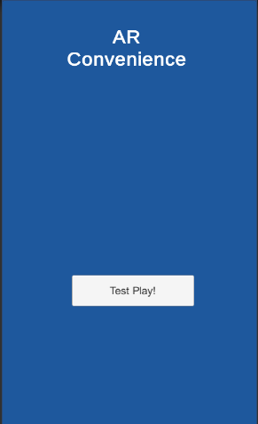

# Augmented-Reality-Convenience-App

## Introduction

This is an Augmented Reality convenience application, which helps with basic activities for the day. 
The application allows user to check the current time and weather in Toronto and this information will be showed in the form of 3D models appearing above the image target. Another special feature for this application voice-controlled alarm system, which you can tell a basic command to make the alarm turn off.

## Development
The app is developed using Unity, C# and basic Vuforia integration. I spent around a month developing the project along with completing high school courses. The project is later on continued to be developed after two months of other projects.

## Challenges
* The hardest challenge is also the new lesson I learned about requesting API in Unity, which I have never tried before. The tough part is within the transfering the information from json file from API request into string in C#. I first got some issues with having the weather not displaying correctly (showing 0 degrees in none date) and that dragged the project development for a week of researching. I looked over some Youtube videos and got the answers from there, which I learned how to read JSON file and load information from online that file into variables in the WWW form of Unity Scripting AI. As a result, I successfully request weather information from Apixu website and display the models and weather broadcast successfully.

* Another smaller challenge is looking for Watson IBM Cloud tutorial to integrate voice command into the application. It took sometimes for Youtube and blog research but I found a video that taught me how to get the API back to the Unity application.

## Major Components
* Vuforia
* Unity

## Future Innovation
* The web view and music player is currently being developed. It will soon be released more.
* The web view could be integrated from the package of unity-webview on github.

## Project Information
* Source: https://github.com/tieuchanlong/Augmented-Reality-Convenience-App
* Android APK download link: https://drive.google.com/file/d/15GW2ggVwkl3Hof4e9O_NPTKAgAz2PWBk/view?usp=sharing
